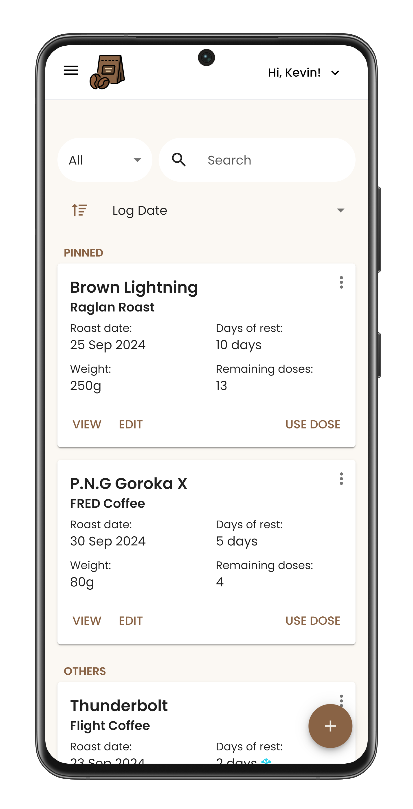
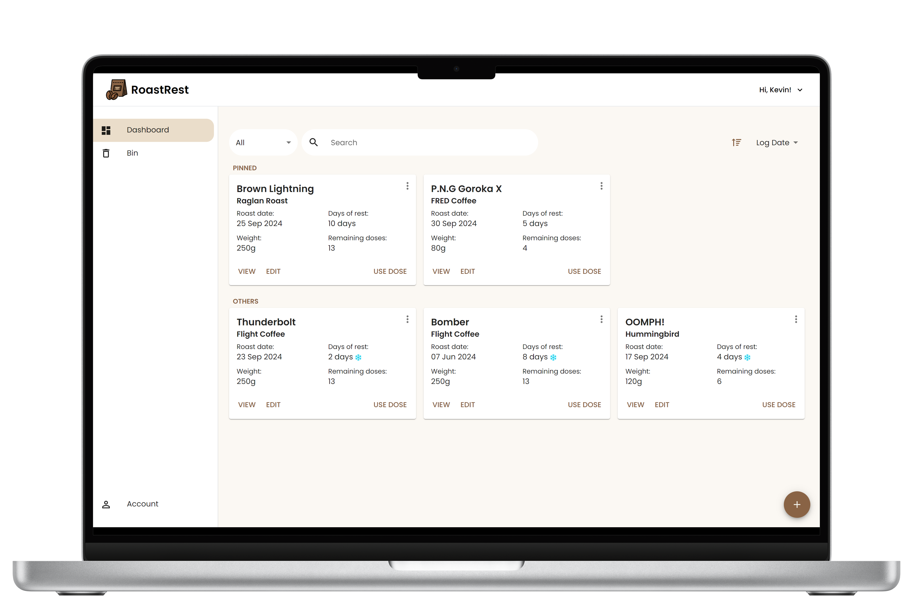

# RoastRest

RoastRest is a free and open source web application developed for coffee enthusiasts to stay organised. Users can keep track of their coffee beans, log useful information, and stay on top of the rest periods to ensure they are brewing the best coffee possible.

## Usage

RoastRest is live and can be accessed [here](https://roastrest.me/).

    
    

